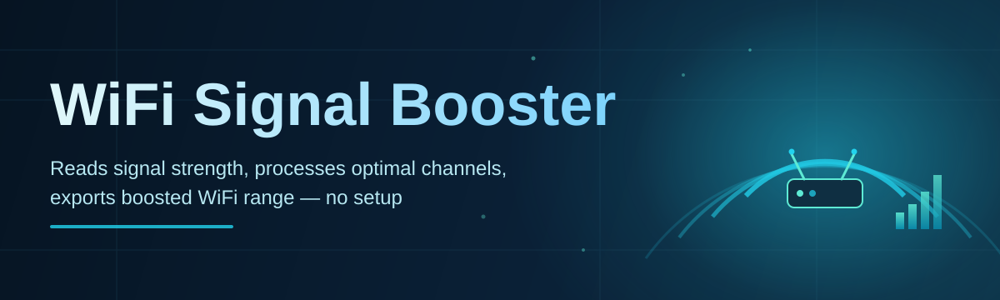
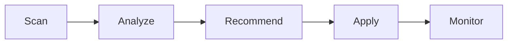

# wifi-signal-booster 📡✨

  

*Squeeze every last bar out of your router — a lightweight Windows companion that maps, tunes, and steadies your wireless signal.*

  

> [!TIP]
> **TL;DR**
> - 🚀 **Zero-dependency Windows app** that scans, diagnoses, and optimizes your WiFi signal in a few clicks.
> - 📊 **Live signal mapping & channel analysis** so you finally know *why* the living room corner has no bars.
> - 🎛️ **One-click boost profiles** for gaming, streaming, and remote work — tuned automatically, adjustable manually.

---

## 🔭 Overview

`wifi-signal-booster` is a desktop utility built for the very ordinary, very annoying problem of weak wireless coverage. Most homes and small offices in 2026 still fight the same battle they did a decade ago: routers stuffed in a closet, neighboring networks screaming on the same channel, and devices that quietly downgrade themselves to a slower band without telling you. This tool exists to make that invisible chaos *visible* — and then to help you fix it without needing a networking degree or a stack of enterprise hardware.

At its core, this is a **signal intelligence and optimization layer** that sits on top of your existing wireless adapter and router. It reads what your hardware already knows — signal strength, channel congestion, noise floor, band utilization — and turns that data into plain-language recommendations and automated adjustments. Whether you're a remote worker tired of video calls freezing, a gamer chasing lower ping jitter, or just someone who wants their smart home devices to stop dropping offline, this tool is built for you.

Unlike bulky router firmware replacements or paid mesh subscriptions, `wifi-signal-booster` is a **standalone, self-contained Windows application**. No cloud account, no recurring fee, no router flashing. It's WiFi signal boosting distilled into something you can open, run, and understand in under five minutes — which is exactly the point.

## 🧰 Core Toolkit

- **Signal Cartography** — Walk through your space while the app builds a live heatmap of signal strength, so dead zones stop being a mystery and start being a marked spot on a floor plan you can actually act on.

- **Channel Congestion Radar** — Continuously listens across 2.4GHz and 5GHz bands, flags overcrowded channels, and suggests the quietest lane for your router to broadcast on.

- **Adaptive Boost Profiles** — Pre-tuned presets (Gaming, Streaming, Remote Work, Smart Home) that adjust priority, scan frequency, and signal thresholds without you touching a single advanced setting.

- **Latency & Jitter Watchdog** — Runs lightweight background pings to detect micro-drops in connection quality before they turn into a frozen call or a rubber-banding game character.

- **Band Steering Assistant** — Nudges compatible devices toward the 5GHz or 6GHz band when they're close enough to benefit, freeing up 2.4GHz for the devices that actually need its longer range.

- **Historical Signal Log** — Keeps a rolling record of signal performance over time, so you can spot patterns like "the WiFi always dips at 8pm when the neighbors start streaming."

- **One-Click Diagnostics Report** — Generates a shareable snapshot of your network's health — handy for troubleshooting with an ISP or just satisfying your own curiosity.

- **Silent Tray-Mode Monitoring** — Minimizes to the system tray and keeps optimizing quietly in the background, surfacing a notification only when something actually needs your attention.

## 🚀 Get Started

> [!NOTE]
> The button above takes you to the official project landing page — that's the only place you should download this tool from.

1. **Visit the landing page** using the button above and grab the latest 2026 build.

2. **Run the application** — no installer wizard, no admin dependencies to chase down first.

3. **Let it scan** your current wireless environment for a baseline reading of signal, channel, and noise.

4. **Pick a boost profile** (or fine-tune manually) and let it keep optimizing quietly in the background.

## 💻 System Requirements

| Requirement | Details |
|---|---|
| **OS** | Windows 10 (64-bit) or Windows 11 |
| **Architecture** | x64 |
| **Dependencies** | None — fully standalone executable |
| **Disk Space** | ~45 MB |
| **RAM** | 150 MB typical, ~300 MB during active scanning |
| **Wireless Adapter** | Any adapter supported natively by Windows |
| **Admin Rights** | Not required for standard scanning; recommended for deep channel diagnostics |
| **Internet** | Not required to run — only needed to check for updates |

> [!IMPORTANT]
> This tool reads and optimizes wireless settings through Windows' own networking APIs. It does not replace your router firmware and does not require rooting, jailbreaking, or modifying any hardware.

## ⚙️ How It Works

The pipeline behind `wifi-signal-booster` is intentionally simple to reason about, even though the signal math underneath is not:

1. **Scan** — The app polls your wireless adapter for live signal strength, SSID visibility, and channel data.

2. **Analyze** — Readings are cross-referenced against known congestion patterns and historical logs to identify weak spots.

3. **Recommend** — A ranked list of fixes is generated: switch channel, reposition router, favor a different band, etc.

4. **Apply** — Chosen adjustments (manual or via a boost profile) are pushed through supported Windows networking settings.

5. **Monitor** — The watchdog keeps sampling in the background, ready to re-trigger analysis if conditions change.

## 🩹 Troubleshooting

<strong>The app shows "No adapter detected" — what now?</strong>

Make sure your wireless adapter driver is enabled in Device Manager and that WiFi isn't currently toggled off via Airplane Mode. The app reads directly from Windows' native adapter list, so if Windows can't see it, neither can the tool.

<strong>My signal heatmap looks patchy or incomplete.</strong>

Heatmaps improve with more sample points — walk slower during a scan and pause briefly in each room. Thick walls, metal appliances, and mirrors are common culprits behind sudden signal cliffs.

<strong>Channel recommendations keep changing every day.</strong>

That's usually a sign your neighborhood WiFi environment is genuinely crowded and shifting. The Congestion Radar re-evaluates regularly — you can lock a channel manually in Settings if you'd rather it stop auto-suggesting.

<strong>Does this replace my router's firmware or settings page?</strong>

No. `wifi-signal-booster` reads and adjusts what it can through Windows networking APIs on your PC — it does not flash, log into, or modify your router directly.

<strong>Boost profile applied but speeds didn't change.</strong>

Some improvements (like band steering) depend on the target device also supporting that band. Check the Historical Signal Log to confirm whether the adjustment actually took effect at the adapter level.

> [!WARNING]
> Applying aggressive boost profiles on adapters with outdated drivers can occasionally cause temporary disconnects. If that happens, revert to the **Balanced** profile and update your adapter driver first.

## 🎨 UI / UX Details

The interface leans minimal on purpose — dense signal data, light chrome around it.

| Shortcut | Action |
|---|---|
| `Ctrl + S` | Start a new signal scan |
| `Ctrl + M` | Toggle live heatmap view |
| `Ctrl + P` | Open boost profile switcher |
| `Ctrl + L` | Open historical signal log |
| `Ctrl + R` | Generate diagnostics report |
| `Ctrl + ,` | Open Settings |
| `Ctrl + Shift + T` | Toggle Light / Dark / Auto theme |
| `Ctrl + Q` | Minimize to system tray |
| `F5` | Refresh current view |
| `Esc` | Close active dialog / cancel scan |

> [!TIP]
> Themes follow your Windows accent color automatically under **Auto**, but you can pin a fixed **Light** or **Dark** theme in Settings if you prefer consistency across screenshots or shared displays.

Settings are grouped into four tabs: **General**, **Scanning**, **Boost Profiles**, and **Notifications** — each adjustable without restarting the app.

## 🤝 Contributing & Community

  

This project grows on community feedback — bug reports, feature ideas, and real-world signal horror stories all help shape the roadmap.

- Open an issue for bugs or feature requests with as much detail on your network environment as you're comfortable sharing.

- Start a discussion thread if you're not sure whether something's a bug or just tricky WiFi physics.

- Pull requests are reviewed with a preference for clear, well-scoped changes over large sweeping rewrites.

> [!NOTE]
> No formal CLA is required for small contributions, but please keep discussion respectful — this is a hobby-and-passion-driven project maintained in spare time.

## 📄 License

Released under the [MIT License](LICENSE), 2026. Use it, adapt it, ship it inside your own tools — just keep the license notice intact.

## ⚠️ Disclaimer

`wifi-signal-booster` optimizes settings within the limits of what your operating system and wireless adapter expose. Real-world results depend heavily on your router hardware, ISP conditions, physical environment, and device compatibility. It is provided **as-is**, without warranty of any kind, and the maintainers are not liable for any network downtime, misconfiguration, or disappointment caused by physics simply refusing to cooperate.

---

